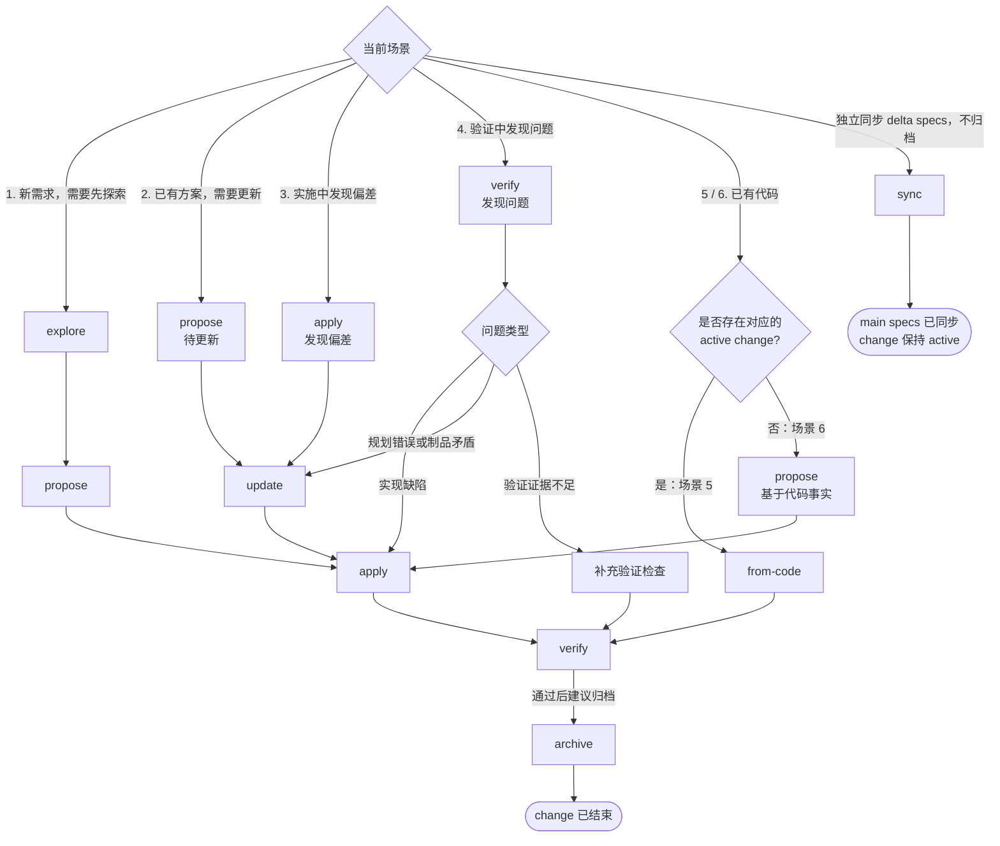
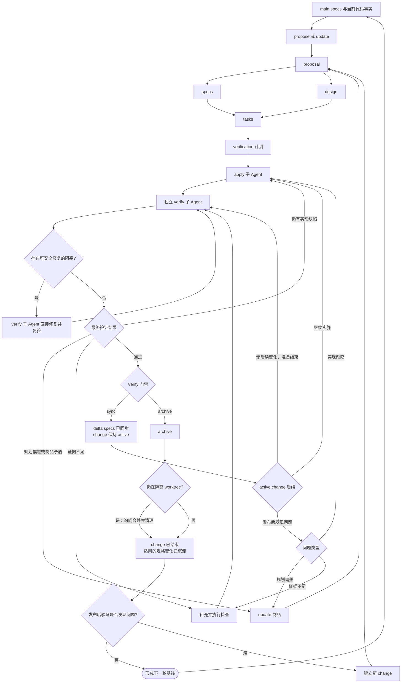

# OpenSpec 场景化工作流

本文按常见工作场景说明 OpenSpec 工作流的选择方式。先判断当前工作处于需求探索、
方案调整、实现、验证还是代码回写阶段，再沿流程图选择对应路径。图中的步骤越多，
通常意味着需要补充或更新的制品越多，整体工作量也越大。

## 各个场景工作量

下图展示六类场景的推荐路径。其中 `explore` 用于澄清问题，`propose` 用于建立
change，`update` 用于调整已有规划，`apply` 用于实施任务，`verify` 用于核验实现，
`archive` 用于结束 change，`sync` 用于在不归档的情况下将 delta specs 合并到
main specs；图中的 `from-code` 是本仓库
`/opsx-update-change-from-code` 命令的简称，仅用于从代码回写已有 active change。

## SDD 增强闭环

上一张图用于选择官方命令场景和推荐路径。目标项目使用本仓库
`evidence-driven` schema，并按[接入文档](ai-tools-integration.md#51-补充-verify-修复闭环与流转门禁)
安装 `AI_TOOLS_VERIFY_GATE_V1` 增强规则后，可形成下面的规格驱动、证据验证和反馈
回流闭环；该增强闭环不改变 OpenSpec 官方命令的默认语义。

闭环中的约束分为两层：

- `evidence-driven` schema 建立 `proposal / specs / design / tasks / verification`
  之间的制品依赖，要求 `apply` 在 `verification.md` 已存在后实施，并跟踪
  `tasks.md`；`verification.md` 负责保存需求与检查的对应关系、实际证据和剩余风险。
- 安装 `AI_TOOLS_PROPOSE_WORKTREE_V1` 后，每次 `propose` 都必须先询问使用隔离
  worktree 还是当前工作区；询问和 worktree 准备发生在创建 change 或写入制品之前。
  选择隔离 worktree 时每次 propose 都必须新建独立 worktree，即使已处于
  linked worktree 也不得复用当前目录；必须先把会话工作区根目录切到新路径，
  切不过去则停止。原生 worktree 可以在仓库外；手工创建才锚定主工作区父目录，
  禁止嵌套。未安装 `AI_TOOLS_PROPOSE_WORKTREE_V1` 时，`propose` 仍以目标项目
  当前 OpenSpec 官方生成物为准。安装 `AI_TOOLS_WORKTREE_FINISH_V1` 后，入口
  Agent 准备结束回复时，只对本次相关隔离 worktree 询问是否合并到主分支并
  清理：本会话创建的路径，或主工作区下项目 worktree 父目录中的当前路径。
  官方主体失败但本次 worktree 已在时也要问。有未提交改动须先经用户明确同意
  提交。不得自动合并或删除，也不得清理兄弟 worktree。主分支指主工作区当前
  检出分支。未安装收尾块时，跑完后不会询问合并或清理。
- 安装 `AI_TOOLS_VERIFY_GATE_V1` 后，入口 Agent 负责编排，不直接执行 apply 或 verify
  主体；apply 子 Agent 成功后才派发独立 verify 子 Agent；单独运行 `/opsx-verify` 时，
  入口 Agent 同样派发 verify 子 Agent。验证过程中可安全修复的阻塞由 verify 子 Agent
  在最多三轮“验证—修复—重新验证”内直接处理；每次修改代码后都针对修复后的完整
  diff 重新执行代码审查并更新 verification。仍未解决的问题再按类型回到 `apply`、
  `update` 或补充检查。阶段内是否并行由每次运行时本会话可用 skills 列表是否含
  `dispatching-parallel-agents` 决定；缺 skill 时与仅派发阶段子 Agent 的串行行为相同，
  后续安装无需再替换注入。磁盘上能读到 `SKILL.md` 不足以为可用。
- `sync` 或 `archive` 入口会检查验证状态为通过、阻塞项为无，并确认记录的工作区
  指纹仍与当前状态一致。验证后的代码或制品变化会使旧门禁失效；`sync` 更新
  main specs 后如果还要归档，也必须先重新验证并刷新门禁。
- 未安装增强规则时，以上子 Agent 派发、门禁与隔离 worktree 收尾均不成立；`verify`、`sync`、`archive`
  的具体条件与行为仍以目标项目当前 OpenSpec 官方生成物为准。OpenSpec 1.10.0 官方
  `/opsx-verify` 只输出会话记分卡（Completeness / Correctness / Coherence），不写
  `verification.md`；官方 `/opsx-archive` 对未完成制品或任务仅警告并允许用户确认
  继续。项目级 Verify 门禁不是官方行为。
- 发布后发现问题时，不修改已归档 change：change 仍为 active 时通过 `update` /
  `apply` 回流，已经归档时建立新 change，进入下一轮规格驱动闭环。

## 场景说明

### 场景 1：新需求，需要先探索

当需求目标、范围或实现方向尚不明确时，先通过 `explore` 梳理问题、约束和可选方案。
结论明确后使用 `propose` 建立 change，再依次完成实现与验证。
`propose` 开始时若已安装 worktree 选择规则，应先选择隔离 worktree 或当前工作区。
若选择隔离 worktree，该会话在 propose / apply / verify / archive 跑完后应询问
是否合并到主分支并清理本次 worktree。

推荐路径：`explore → propose → apply → verify → archive`。

该场景步骤最多，但能在实施前消除关键歧义，适合影响范围较大、存在多种实现方案，
或需要先确认边界的新需求。

### 场景 2：已有方案，需要更新

当 change 已经建立，但 proposal、specs、design、tasks 或 verification 与最新决策
不一致时，使用 `update` 更新规划，再继续实施和验证。

推荐路径：`propose（待更新）→ update → apply → verify → archive`。

更新时应说明变化原因及受影响的制品，确保任务、设计和验证计划仍然相互一致。

### 场景 3：实施中发现偏差

在 `apply` 过程中，如果发现原方案遗漏边界、任务拆分不合理或实现约束发生变化，
应暂停实施并通过 `update` 回写规划，然后基于更新后的 change 继续工作。

推荐路径：`apply（发现偏差）→ update → apply → verify → archive`。

如果偏差来自实现缺陷，应直接修复代码；只有确认规划本身需要变化时，才更新 change，
避免为了迁就错误实现而修改规格。

### 场景 4：验证中发现问题

在 `verify` 阶段发现问题时，应先判断问题类型，再选择处理路径：

- 实现不满足需求：若修复安全、在当前 change 范围内且无需用户决策，由 verify 子
  Agent 直接修复并复验；否则返回 `apply` 修复实现，再重新验证。
- 规划错误或制品之间存在矛盾：使用 `update` 修正规划，再通过 `apply` 完成必要
  修改并重新验证。
- 验证证据不足：补充并执行缺失的检查，再重新验证；不要仅为补证据而修改规划。

重新验证时应覆盖受影响的需求与场景，并保留失败原因、处理结果和剩余风险。

### 场景 5：已有代码，且存在 active change

当代码已经发生变化，同时存在对应的 active change 时，使用
`/opsx-update-change-from-code` 比较代码事实与现有制品，将确认需要保留的实现回写
到 change，再执行验证。

推荐路径：`/opsx-update-change-from-code → verify → archive`。

该路径适用于“实现领先于规划”的情况，不用于把缺陷合理化。若代码行为不正确，
仍应修复代码，而不是将错误行为写入 change。

### 场景 6：已有代码，但不存在 active change

当代码已经存在，却没有可更新的 active change 时，应直接基于可确认的代码事实使用
`propose` 建立完整 change，记录目标、范围和验证方式，再通过 `apply` 补齐任务或
调整实现，最后执行验证。不要先建立空 change 再调用
`/opsx-update-change-from-code`：该命令只更新已有制品，不负责创建缺失制品。
`propose` 开始时若已安装 worktree 选择规则，应先选择隔离 worktree 或当前工作区。
若选择隔离 worktree，该会话在后续命令跑完后应询问是否合并到主分支并清理本次
worktree。

推荐路径：`propose（基于代码事实）→ apply → verify → archive`。

新建 change 时应以可确认的代码事实为依据，同时区分“当前已经实现的行为”和
“仍需完成的工作”，避免把现状直接当作正确需求。

## 独立旁路：同步 delta specs

需要将 active change 内的 delta specs 合并到 main specs、但暂不归档时，可独立使用
官方 `/opsx-sync`。该命令只同步规格，不会结束 change；是否需要先执行 `verify`，
以及后续何时归档，遵循目标项目当前官方生成物。若 sync 发生在隔离 worktree 中，
跑完后仍须询问是否合并到主分支并清理本次 worktree。

## 使用原则

- 不确定需求或方案时先 `explore`，不要在关键问题未澄清时直接实施。
- 已有 active change 时优先更新该 change，避免为同一工作重复建立规划。
- 实现或验证阶段发现规划偏差时，通过 `update` 保持制品与最新决策一致。
- `/opsx-update-change-from-code` 只负责按已确认的代码事实回写已有 active change，
  不能建立 change，也不能替代缺陷修复。
- 编写 `tasks.md` 时，每项任务必须在 `- [ ]` 说明中写明如何验证完成。
- 定位或修改主规范时使用 `openspec instructions apply --change "<name>" --json` 或
  `openspec status --change "<name>" --json` 中的 `planningHome.root`，不要假设仓库相对路径。
- 实现完成后建议核验。安装 `AI_TOOLS_VERIFY_GATE_V1` 后，apply 与单独
  `/opsx-verify` 均由入口 Agent 派发子 Agent 执行，阶段内并行仅当运行时会话 skills
  列表含 `dispatching-parallel-agents` 时启用，并通过 Verify 门禁与工作区指纹
  约束 sync/archive；未安装增强规则时，`verify`、`sync`、`archive` 的具体条件与行为
  遵循目标项目当前 OpenSpec 官方生成物（1.10.0 官方 verify 仅为会话记分卡，官方
  archive 允许确认绕过）。
- 隔离 worktree 跑完后不得默认留下现场。安装 `AI_TOOLS_WORKTREE_FINISH_V1` 后，
  入口 Agent 必须询问是否合并到主分支并清理本次相关 worktree；未明确选择或
  未同意提交时不得合并或删除。长期手工 worktree 不在收尾范围。
